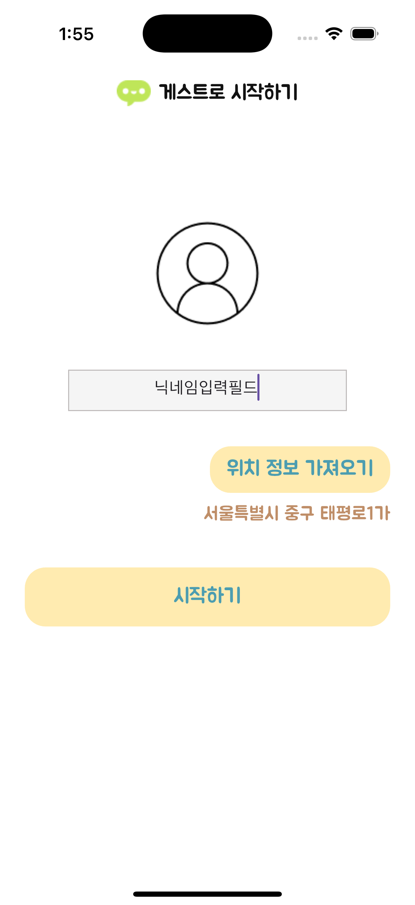
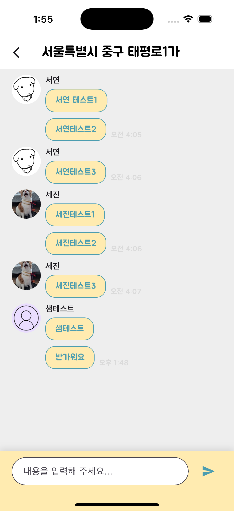
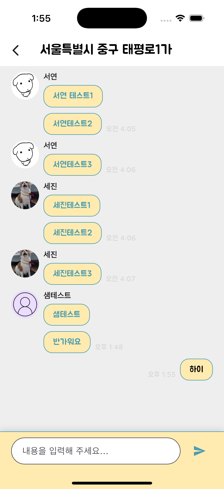

# 💬 동네온(On) – GPS 기반 채팅 앱

**Dart, Flutter** 기반의 "동네에 온, 따뜻한 사람들과 연결"되는 **지역 친구 만들기 앱**입니다.  
사용자는 메인에서 **image picker**를 통해 프로필 사진과 닉네임을 설정할 수 있습니다.  
**geolocator**를 통해 가져온 위경도 정보를 **vworld OPEN API**를 통해 읍면동 주소로 변환한 정보로 위치를 설정할 수 있습니다.  
채팅에서는 읍면동 주소로 변환한 위치정보를 토대로 **Firebase Firesotre**를 이용한 실시간 채팅을 경험할 수 있습니다.  

---

## ⚙️ 실행 예시

  
  
  
  

[시연영상] https://www.youtube.com/shorts/_STrBwb0l3U

---

## 🚀 주요 기능
- **image picker를 이용한 프로필 사진 설정**
- **geolocator를 활용한 기기 위경도 값 가져오기**
- **vworld OPEN API를 이용한 읍면동 주소 가져오기**
- **Firebase Firesotre를 이용한 실시간 채팅 기능**
- **Lottie를 이용한 움직이는 스플래시**

---

## 🛠 기술 스택
- **언어**: Dart
- **프레임워크**: Flutter
- **라이브러리**: Firebase Firestore, Riverpod, Dio, Geolocator, Lottie, Flutter Native Splash

---

## 📂 프로젝트 구조
<pre>
assets/             # 에셋
lib/            
├── main.dart       # 진입점
├── utils/          # 유틸리티
├── models/         # 데이터 모델(유저, 채팅)
├── repositorys/    # API 연동, 통신코드 (Firestore, vwworld)
├── view_model/     # 상태관리 및 비즈니스 로직(Riverpod 기반)
└── screens/        # UI 화면
</pre>

---

## 🔍 설치 및 실행 방법

git clone  
cd 디렉토리  
flutter pub get  
flutter run  
